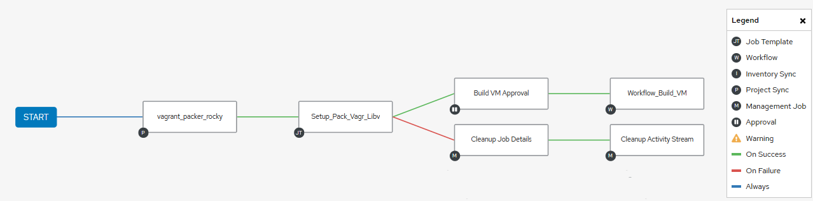
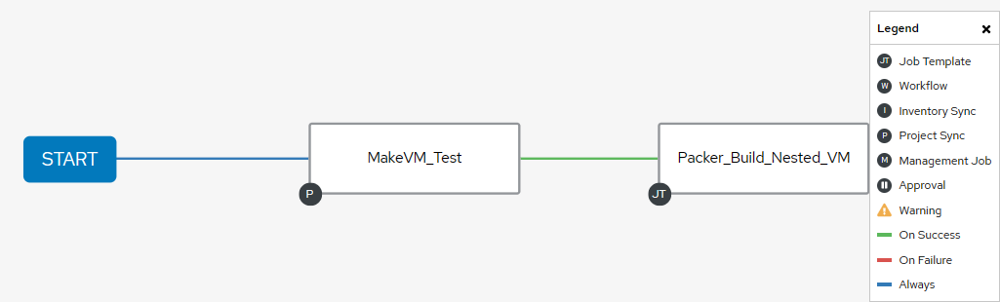
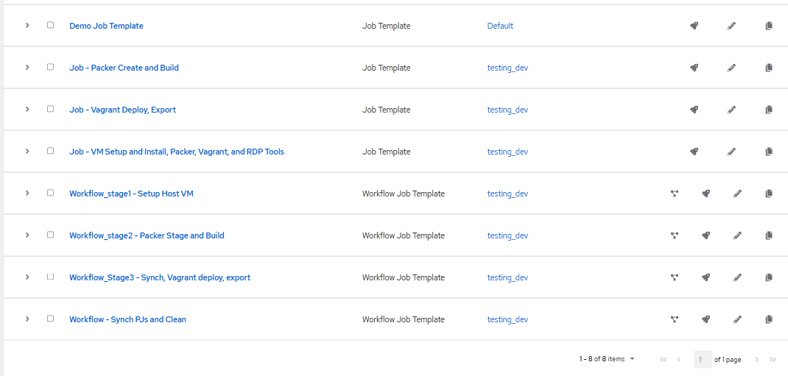
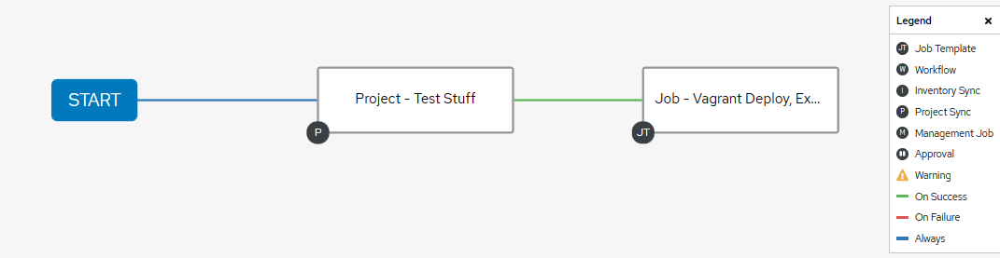
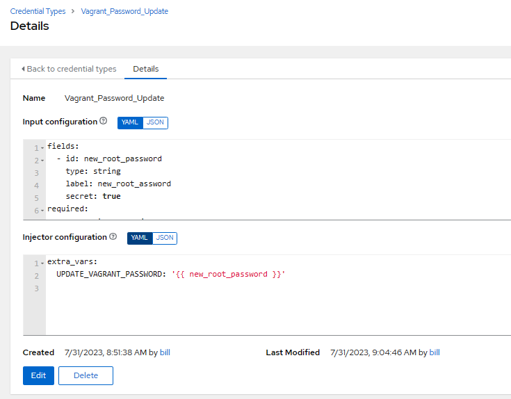

# Test Stuff

Goals:

1. **Make the Base VM**
  - Base VM is the VM that nested virtualization will occur on.  
  - Libvirt_packer_ansible playbook  
    [Pakr Vagr Libvirt](https://github.com/bvaughn123/Libvirt-Vagrant-Packer)  
  
2. **Create a testing workflow**, AWX Demo. 
  - Examples below shows stages.
  - Workflow approvals required after each stage completion (approval/disapprove).  
  - Workflow Execution can be ran from any point if the required files and dependencies exist (Prior workflows already ran).
    - Example uses:  
      Creating new base boxes via kickstarts (WF2)
      Updating the Selection VM settings Dict, the Selection Var, ect. (WF3)
    
    [Pakr Vagr Libvirt](https://github.com/bvaughn123/Libvirt-Vagrant-Packer)  
    
    > Synch proj., exec play, request for approval -> condition based action.  

  

  

3. **Packer Build w/ vagrant post provision**
  - Provision and use vagrant post processor to create base.box   
    [make test vm thingys](https://github.com/bvaughn123/mk_vm_test_thingys)  

  


4. **Create Dynamic vagrantfile*** with selection conditional for vagrant box,   
  enabling vagrant up, down, halt, and stuffs.  

  [Template Readme](ansible/templates/config.yaml.example.md)  

5. **Build Nested vm using libvirt and vagrant box**  

- [x]  Add template or additonal tasks with appropriate to dynamically launch  
      additional tasks / playbooks with vagrant provisioner.  
    - Created marker for afterline task in vagrant file.  

- [x] Implement Custom Vagrant Ansible Module for running vagrant commands  
     [Vagrant Custom Plugin Readme](.Resources/Vagrant_Plugin.md)

## AWX Jobs  

Using AWX Workflow templates to synch repositories, launch jobs, and kick off Next Stage Workflows.  

Personal reasons I like AWX is the organic synchronization of projects, creds storage, and others, but most  
importantly - visual context.  



## Packer build  

Packer Build w/ post vagrant provisioner to build box   

Moving these to seperate workflow.  

- [x] Need to create a task to launch the packer build of the base vm.   
    `Going to move externally to segrate workflow tasks` [Make vm test thingys](https://github.com/bvaughn123/mk_vm_test_thingys)  
- [x] Need to come up with logic for choosing the pkr.hcl file...  
    `Going to move externally to segrate workflow tasks` [Make vm test thingys](https://github.com/bvaughn123/mk_vm_test_thingys)  
- [x] Need to ensure task for vagrant install libvirt plugin is done  

## Dynamic Vagrantfile  

Re-use and "agnosticize" things.  

- [x] template for vars to be imported from file for vagrantfile.  
- [x] Create a j2 template to generate vars for the vagrantfile  
    > config.yaml   
- [x] Box Selection: config.vm.box = "file://boxes/libvirt-{{box_name}}" based on selection in config.yaml  

Below is the applicable portion of the "Agnosticized" vagrantfile.

    ```ruby
        # encoding: utf-8
        # -*- mode: ruby -*-
        # vi: set ft=ruby :

        require 'yaml'

        # Load Dynamic Vars from config.yaml generated file
        current_dir    = File.dirname(File.expand_path(__FILE__))
        configs        = YAML.load_file("#{current_dir}/config.yaml")
        vagrant_config = configs['configs'][configs['configs']['select']]
        base_name      = vagrant_config['base_box']

        Vagrant.configure('2') do |config|
          config.vm.box = "file://boxes/"+box_name
          #....other variables below.....    
    ```

### Agnostic Vagrantfile and Templated Vars for nested vm creation  

1. Declare values for the vars to be imported into the "agnosticized" vagrant.   
   These are defined in two places, but are nested. Might not sense, but thoughts that it will  
   help potential playbook -> role conversion.  

2. Use a template to create the mappings and yaml.  
> [config.yaml.j2 ](ansible\templates\config.yaml.j2)  

3.  Finally, the Select variable, will be the conditional selection criteria for what keys are parsed  
    by the Vagrantfile when conducting actions that generate or interact with vms.  

> [config.yaml.j2 ](ansible\templates\config.yaml.j2)  

      ```yaml  
        ---  

        # Default VM Selection
        vm_selection: "test1" 
        
        # Name, box_name.box, cpus, memory, driver 
        VARS_VAGRANT_SYSTEM_SETTINGS:
          - ["centos7","centos7.box","2","2048","default_driver",]
          - ["rocky8","rocky8.box","2","2048","default_driver",]
          #- ["test3","base_box","cpu","memory","default_driver",]
      ```
An example output of the template creation for the config.yaml file below.  

```yaml
---
configs:
  select: "{{ VM_SELECTION }}"
    
    centos7:
      base_box: "centos7.box"
      cpu_int: 2
      memory_int: 2048
      default_driver_string: "qemu"

    rocky8:
      base_box: "rocky8.box"
      cpu_int: 2
      memory_int: 2048
      default_driver_string: "kvm"
```  

  


### Updating the Default Vagrant Password  

Multiple options exist.  As this PoC is using the AWX workflow to execute; will default to utilize  
protected credentials on the AWX Controller.  

  

[AWX Documentation](https://docs.ansible.com/ansible-tower/latest/html/userguide/credential_types.htmlhttps://docs.ansible.com/ansible-tower/latest/html/userguide/credential_types.html) / Ansible Tower Official Docs.

### Virtsh and Virtualization tools CLI Cheatsheet for troubleshooting

Cheatsheets:
- [Virtsh Cheatsheet](.Resources/virtcheatsheat.md)
- [Qemu Cheatsheet](.Resources/qemucheatsheet.md)


### Notes 


- [ ] Attempt change via encrypted awx and `vagrant ssh -c "echo {{pass}} | passwd root --stdin`  Need to see if this will cause log entry, or if need to export to env Var and ref that.  

