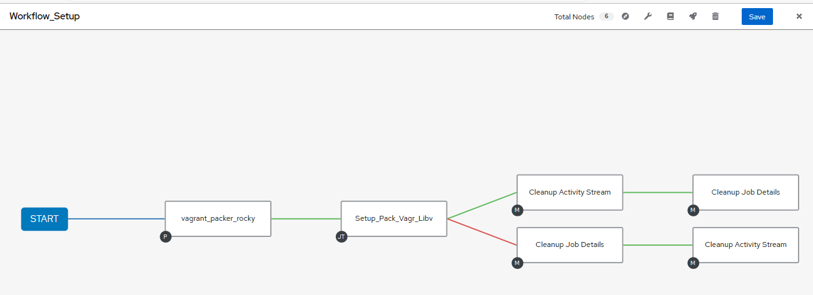

# Test Stuff

Thoughts:

1. **Make the Setup VM**
2. **Create a testing workflow**
3. **Packer Build w/ vagrant post provision**  
4. **Create Dynamic vagrantfile*** for use with vagrant box   
5. **Build Nested vm using libvirt and vagrant box**

## Make the Setup VM

Setup Packer, Libvirt, and Vagrant via playbook
- [x] rdp added
- [ ] Remove manual and add task for vagrant install plugin libvirt 
[Pakr Vagr Libvirt](https://github.com/bvaughn123/Libvirt-Vagrant-Packer)  

## Create a testing workflow

AWX Test Workflow using Static Inventory (single test vm)

||
|:--:|
| *Simple Workflow* |

Cool bells:

- [ ] Would be cool to have a dynamic inventory using tags via the awx vcenter plugin  
        - [Using VMware vCenter Tags in a Red Hat Ansible Tower Dynamic Inventory](https://www.ansible.com/blog/using-vmware-vcenter-tags-in-a-red-hat-ansible-tower-dynamic-inventory)  

- [ ] Utilization of Surveys in the jobs, though unsure how it ineracts with workflows...

  - Currently using hardcoded inventory in awx

||
|:--:|
| **Static Inventory** |

||
|:--:|
| **Connectivity Check** |

## Packer build

Packer Build w/ post vagrant provisioner to build box 

- [ ] Need to ensure task for vagrant libvirt plugin is done
- [ ] Need to create a task to launch the packer build
    - Unsure if there is another way than ansible shell/command task?  
- [ ] Create a var to launch the "flavor" (centos, rocky, windows, ect)
    - will need to ensure the applicable hcl vars file reflects for post-proccesor build
    **May solve the backlog task of ovf creation by adding an extra task to do a qemu-img convert**    

## Dynamic Vagrantfile

- [ ] Create a j2 template to generate the Yaml vars for the vagrantfile

  

- [ ] Create a j2 file to for the ansible provisioner (below has a shell provisioner) to select playbook  

  
 

## Build Nested vm

- [ ] Need to see if other way to launch than using ansible shell (is there a module?)

