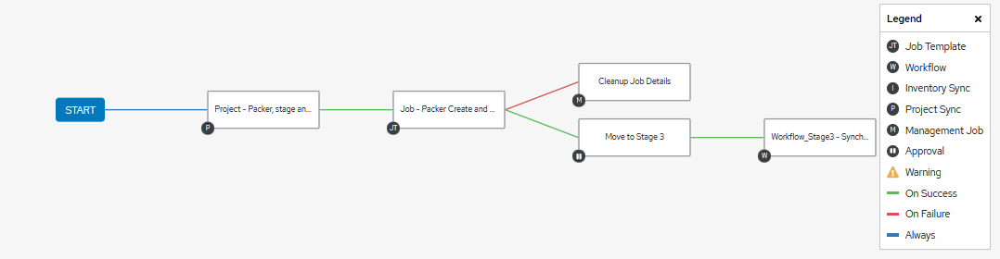

# Test Stuff

Goals:

1. **Make the Setup VM**  
  - Libvirt_packer_ansible playbook  
    [Pakr Vagr Libvirt](https://github.com/bvaughn123/Libvirt-Vagrant-Packer)  
  
2. **Create a testing workflow**
  - Example in Libvirt_packer_ansible playbook  
    [Pakr Vagr Libvirt](https://github.com/bvaughn123/Libvirt-Vagrant-Packer)  
    
    > Synch proj., exec play, request for approval -> condition based action.

()
()

3. **Packer Build w/ vagrant post provision**
  - Provision and use vagrant post processor to create base.box 
    [make test vm thingys](https://github.com/bvaughn123/mk_vm_test_thingys)

()
4. **Create Dynamic vagrantfile*** for use with vagrant box   
  
5. **Build Nested vm using libvirt and vagrant box**  


## AWX Jobs

Using AWX Workflow templates to synch repositories, launch jobs, and kick off Next Stage Workflows.

Personal reasons I like it, is it helps provide visual context.

()

## Packer build

Packer Build w/ post vagrant provisioner to build box 

Moving these to seperate part of workflow.

- [x] Need to create a task to launch the packer build of the base vm.  
    `Going to move externally to segrate workflow tasks` [Make vm test thingys](https://github.com/bvaughn123/mk_vm_test_thingys) 
- [x] Need to come up with logic for choosing the pkr.hcl file...
    `Going to move externally to segrate workflow tasks` [Make vm test thingys](https://github.com/bvaughn123/mk_vm_test_thingys) 
- [x] Need to ensure task for vagrant install libvirt plugin is done

## Dynamic Vagrantfile

Re-use and "agnosticize" things.

- [x] template for vars to be imported from file for vagrantfile.
- [x] Create a j2 template to generate vars for the vagrantfile
    > config.yaml  
- [x] Box Selection: config.vm.box = "file://boxes/libvirt-{{box_name}}" based on selection in config.yaml


    ```
        # encoding: utf-8
        # -*- mode: ruby -*-
        # vi: set ft=ruby :

        require 'yaml'

        # Load Dynamic Vars from config.ymaml generated file
        current_dir    = File.dirname(File.expand_path(__FILE__))
        configs        = YAML.load_file("#{current_dir}/config.yaml")
        vagrant_config = configs['configs'][configs['configs']['select']]


        Vagrant.configure('2') do |config|
        base_name = vagrant_config['base_box']
          config.vm.box = "file://boxes/"+box_name
            
    ```

- [ ] Do I create a task to Halt box, package, unzip, and perform a qemu-img -c to convert to ovf?
    **May solve the a backlog task of ovf creation, but will require a qemu-img convert task on the box.img file in the box package**     

### Template Creation

Create the Vars to be imported into the "agnosticized" vagrant file.  
> [config.yaml.j2 ](ansible\templates\config.yaml.j2)

- [x] vars/vagrant_vm_vars.yaml
      ```yaml
        ---

        # Default VM Selection
        vm_selection: "test1" 
        
        # Name, box_name.box, cpus, memory, driver 
        VARS_VAGRANT_SYSTEM_SETTINGS:
          - ["centos7","centos7.box","2","2048","default_driver",]
          - ["rocky8","rocky8.box","2","2048","default_driver",]
          #- ["test3","base_box","cpu","memory","default_driver",]
      ```

### config.yaml example

```yaml
---
configs:
  select: 'test1'

    test1:
      base_box: "centos7.box"
      cpu_int: 2
      memory_int: 2048
      default_driver_string: "qemu"
    
    test2:
      mode: deploy
      base_box: "rocky8.box"
      cpu_int: 2
      memory_int: 2048
      default_driver_string: "kvm"
      
```

### Updating the Default Vagrant Password

Multiple options exist.  As this PoC is using the AWX workflow to execute; will default to utilize
protected credentials on the AWX Controller.


[AWX Documentation](https://docs.ansible.com/ansible-tower/latest/html/userguide/credential_types.htmlhttps://docs.ansible.com/ansible-tower/latest/html/userguide/credential_types.html)


### Notes 31July

- [ ] Vagrant Custom Plugin not working, need to troubleshoot and understand the subprocess.check_call function mo betta

- [ ] Possible issue with the permission on the vagrant plugin file, need to ensure workflow task that installs libvirt is done as `"{{ REMOTE_USER }}"`.  Temp fix is `vagrant plugin expunge --reinstall`

- [ ] Going to attempt change via encrypted awx and `vagrant ssh -c "echo {{pass}} | passwd root --stdin`  Need to see if this will cause log entry, or if need to export to env Var and ref that.

- [ ] Need to check become_user on tasks to ensure permissions are correct.

- [ ] Vagrantfile/j2 keys and vars.

